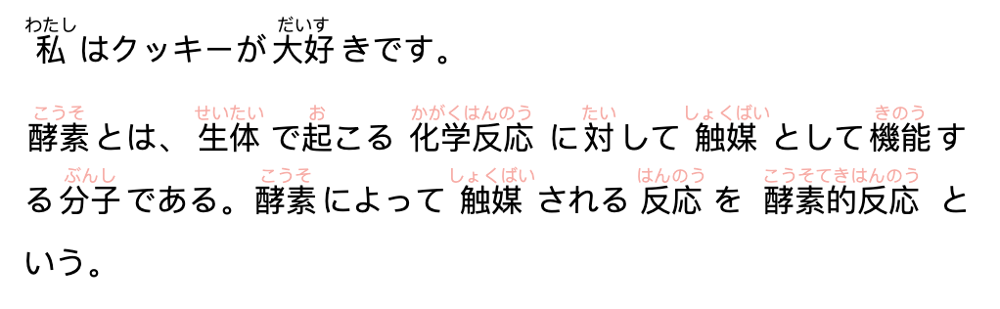

# furigana-react | ふりがなレアクト

> an easy element to wrap text that contains kanji

[](https://www.npmjs.com/package/furigana-react) [](https://standardjs.com)


## Install

```bash
npm install --save furigana-react
```

## Usage

wrap the text you want to add furigana too in this components and add in the furigana for each kanji compound.
```
大好 = だいす  🙆
大 = だい     🙅
```

```tsx
import * as React from 'react'

import { Furigana } from 'furigana-react'

export default class App extends Component {
  render () {
    return (
      <div>
        {/* hatsuon maybe better prob name */}
        <Furigana furigana="わたし:だいす">
          私はクッキーが大好きです。
        </Furigana>
        <Furigana
          id="example2"
          furigana="こうそ:せいたい:お:かがくはんのう:たい:しょくばい:きのう:ぶんし:こうそ:しょくばい:はんのう:こうそてきはんのう"
          opacity={0.4} // default is 1
          spacingUnit={5} //default is 6
          >
          酵素とは、生体で起こる化学反応に対して触媒として機能する分子である。酵素によって触媒される反応を酵素的反応という。
        </Furigana>
      </div>
    )
  }
}
```
## Result



## License

MIT © [stagfoo](https://github.com/stagfoo)
